<!-- Typing Animation -->

---

### Informatics Engineering Student · Full-Stack & Backend Developer

I build software systems from the ground up — designing backend architecture, developing full-stack applications, structuring data, and deploying reliable products.

---

## 💻 Tech Stack & Tools

  
   
  
   
  

---

## Featured Projects

<table>
<tr>
<td width="50%">

### 🛒 Seventh Sky Store

Full-stack fashion e-commerce platform with product catalog, shopping cart, checkout flow, and admin dashboard.

**Key Features**
- Product management & categories
- Cart & checkout system
- User authentication & authorization
- Admin dashboard & order management

**Tech:** Laravel · React · MySQL

🔗 [Repository](https://github.com/SyafiqArsy/sevenths-sky-store)

</td>
<td width="50%">

### 👗 Seventh Sky Style

AI-powered personal fashion stylist that provides outfit recommendations based on user preferences and style analysis.

**Key Features**
- AI outfit recommendations
- Style preference analysis
- Personalized fashion suggestions
- Modern responsive interface

**Tech:** Next.js · FastAPI · PostgreSQL

🔗 [Repository](https://github.com/SyafiqArsy/seventh-sky-style)

</td>
</tr>
<tr>
<td width="50%">

### 🌐 Portfolio Website

Personal developer portfolio showcasing projects, skills, and professional experience with a modern design.

**Key Features**
- Project showcase & case studies
- Skills & tech stack visualization
- Responsive & accessible design
- Performance optimized

**Tech:** Next.js · Tailwind CSS

🔗 [Repository](https://github.com/SyafiqArsy/syafiqarsy-portofolio)

</td>
<td width="50%">

<!-- Empty cell for alignment -->
</td>
</tr>
</table>

---

## GitHub Activity

<!-- Contribution Snake — Dark/Light theme switching -->
<picture>
  <source media="(prefers-color-scheme: dark)" srcset="assets/contribution-snake-dark.svg" />
  <source media="(prefers-color-scheme: light)" srcset="assets/contribution-snake.svg" />
  
</picture>

---

## Connect

---

